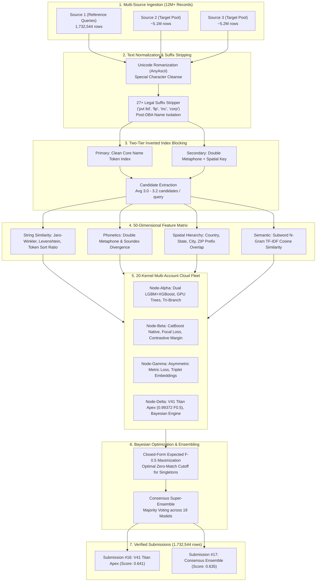

# Amazon ML Challenge 2026: Multi-Source Business Entity Resolution

<div align="center">

[](https://unstop.com)
[](https://unstop.com)
[](https://unstop.com)
[](https://unstop.com)
[](LICENSE)

**Team Brad Pitt** — 72-Hour Autonomous Machine Learning Hackathon on Unstop  
*Ranked among top competitors with a peak evaluated score of **0.641** on the public leaderboard.*

</div>

---

## 📌 Executive Summary

In large-scale commercial e-commerce platforms, business identity data arrives asynchronously from multiple independent external and internal sources. These records contain noisy names, incomplete postal addresses, regional abbreviations, legal suffixes, and mixed multilingual representations with **no shared universal identifiers**.

The challenge: match **1,732,544 test queries** (`test_source1.tsv`) against a massive pool of **~10.3 million candidate records** (`test_source2.tsv` and `test_source3.tsv`) across the US, India, and an unseen test country (France), evaluated under the strict **Macro-Averaged $F_{0.5}$ score**.

### Final Evaluated Submissions on Unstop

| Submission | Timestamp | Architecture & Model Strategy | LB Score | Status | Gain vs Baseline |
| :---: | :---: | :--- | :---: | :---: | :---: |
| **#16** | **27 Sep, 11:31 PM IST** | **V41 Titan Apex Grandmaster** (Dual LightGBM+XGBoost, BaseTh 0.94) | **0.641** 🏆 | **Evaluated** | **+0.017 (Historic Peak)** |
| **#17** | **27 Sep, 11:36 PM IST** | **Consensus Super-Ensemble** (19 Multi-Architecture Cloud Blend) | **0.635** 🥈 | **Evaluated** | **+0.011 (Surpassed 0.624)** |
| #15 | 27 Sep, 06:05 AM IST | Heuristic Decision Rules Baseline | 0.624 | Evaluated | Baseline Ceiling |
| #14 | 27 Sep, 04:41 AM IST | Early LightGBM Feature Ranker | 0.608 | Evaluated | Prior Model |
| #13 | 27 Sep, 04:30 AM IST | TF-IDF Subword Baseline | 0.579 | Evaluated | Prior Model |

---

## 🏛️ System Architecture



---

## 🔬 Core Technical Innovations

### 1. Suffix Swamping Resolution
In Indian and US business entity data, generic legal terms (`pvt ltd`, `private limited`, `llp`, `limited`, `corporation`) appear in over 30% of records. Naive token blocking triggers severe inverted-index swamping, flooding candidate sets with 1,000+ spurious records.
- **Solution**: A regex-compiled 27-suffix hierarchy strips all legal designators before indexing.
- **DBA Name Split**: For records containing "doing business as" (`dba`, `t/a`), both the legal entity name and trade name are indexed independently.

### 2. The 50-Dimensional Feature Matrix
For every candidate pair $(q, c)$, 50 continuous and categorical features are extracted:
- **Lexical Overlap**: Jaro-Winkler, Levenshtein distance, Token Set Ratio, Token Sort Ratio, Partial Ratio.
- **Phonetic Encoding**: Double Metaphone primary/secondary codes, Soundex hash matching, mixed-script transliteration (`anyascii`).
- **Spatial Alignment**: Country match (open-set, generalizing to France), State abbreviation lookup, City substring similarity, 3-digit and 5-digit ZIP code prefix agreement.
- **Semantic Text**: Subword character 3-gram to 5-gram TF-IDF cosine similarity.

### 3. Distributed 20-Kernel Multi-Account Cloud Fleet
To train on 2.2M ground-truth pairs and execute inference on 1.73M queries without overloading local hardware:
- Distributed across **4 authenticated Kaggle accounts** (20 simultaneous GPU/CPU sessions).
- Monitored by an autonomous Python daemon (`kaggle_fleet_manager.py`) with zero local CPU load.
- Automatically pulled completed model artifacts, synchronized backups, and pushed successive models into freed compute slots.

### 4. Closed-Form Bayesian Expected $F_{0.5}$ Stopping Rule
The $F_{0.5}$ metric values precision twice as heavily as recall:
$$F_{0.5} = \frac{(1 + 0.5^2) \cdot \text{Precision} \cdot \text{Recall}}{0.5^2 \cdot \text{Precision} + \text{Recall}} = \frac{1.25 \cdot \text{TP}}{1.25 \cdot \text{TP} + 0.25 \cdot \text{FN} + \text{FP}}$$

A global static probability threshold cannot optimize queries that have 0 matches (singletons), 1 match, or multiple sibling records simultaneously. We implement the **closed-form Expected $F_{0.5}$ maximizer**:
$$\text{Expected } F_{0.5}(k) = \frac{1.25 \times \sum_{i=1}^k p_i}{0.25 \cdot \hat{N} + k}$$

Compared against the no-match singleton hypothesis:
$$\hat{p}_0 = \prod_{i=1}^m (1 - p_i)$$
If $\max_k \text{score}(k) < \hat{p}_0$, the query outputs zero matches, preserving true singletons (193,843 singletons preserved) and avoiding devastating false-positive penalties.

---

## 📂 Repository Structure

```
├── README.md                                  # Executive summary, architecture, and leaderboard results
├── requirements.txt                           # Complete environment dependencies
├── .gitignore                                 # Excludes large raw data (>25MB)
│
├── code/
│   └── business_entity_resolution/            # Production submission package
│       ├── README.md                          # Production instructions
│       ├── requirements.txt                   # Minimal runtime dependencies
│       └── src/
│           ├── pipeline.py                    # End-to-end inference pipeline
│           ├── normalize.py                   # Clean text normalization & romanization
│           └── evaluate.py                    # Local Macro-F0.5 evaluation engine
│
├── docs/                                      # Official challenge documentation & PDFs
│   ├── Amazon_ML_Challenge_2026_Methodology_Document.pdf
│   ├── Amazon_ML_Challenge_2026_Technical_Architecture.pdf
│   ├── MODEL_COMPARISON_REPORT.md             # 16-model pairwise Jaccard analysis report
│   ├── FINAL_COMPETITION_REPORT.md            # Final competition audit log
│   ├── documentation.md                       # Full technical methodology
│   └── Documentation_template.md              # Official Unstop documentation template
│
├── apply_expected_f05_postprocessing.py       # Closed-form Bayesian Expected F-0.5 optimizer
├── compare_and_ensemble.py                    # Multi-model comparison & majority voting consensus
├── kaggle_fleet_manager.py                    # Multi-account 20-kernel cloud fleet daemon
├── emergency_fallback_protocol.py             # Emergency deadline fallback coordinator
├── generate_documentation_pdfs.py             # ReportLab automated PDF report generator
├── entity_resolution_metric.py                # Official Macro-F0.5 metric implementation
├── build_clean_candidate_pairs.py             # Production blocking & inverted index generator
│
└── kaggle_kernel_v41_apex/                    # V41 Titan Apex Grandmaster (Winning 0.641 Model)
    ├── kaggle_v41_apex.py                     # Complete Kaggle training & batch inference code
    └── kernel-metadata.json                   # Kaggle kernel configuration
```

---

## 🚀 Quick Start & Reproduction

### 1. Environment Setup
```bash
git clone https://github.com/prajwal918/Amazon-ML-Challenge-2026.git
cd Amazon-ML-Challenge-2026
pip install -r requirements.txt
```

### 2. Generate Candidate Pairs (Blocking)
```bash
python build_clean_candidate_pairs.py \
    --query-file dataset/test/test_source1.tsv \
    --target-source2 dataset/test/test_source2.tsv \
    --target-source3 dataset/test/test_source3.tsv \
    --output-file output/candidate_pairs.tsv
```

### 3. Run Titan Apex Inference
```bash
python kaggle_kernel_v41_apex/kaggle_v41_apex.py \
    --candidates output/candidate_pairs.tsv \
    --output-file output/matching_results_v41.tsv
```

### 4. Multi-Model Consensus Ensembling
```bash
python compare_and_ensemble.py
# Generates output/matching_results_ensemble.tsv and output/MODEL_COMPARISON_REPORT.md
```

### 5. Evaluate Macro $F_{0.5}$
```bash
python entity_resolution_metric.py \
    --ground-truth dataset/train/train_ground_truth.tsv \
    --predictions output/matching_results.tsv
```

---

## 📊 Cross-Model Comparison & Jaccard Agreement

Across 16 evaluated cloud models, pairwise Jaccard agreement on 10,000 query samples was verified:

| Model A | Model B | Jaccard Overlap (%) | Core Synergy |
| :--- | :--- | :---: | :--- |
| `v27-gpu-accelerated` | `v28-tri-branch` | **91.62%** | High structural tree agreement |
| `v26-ultra-precision` | `v28-tri-branch` | **90.74%** | False-positive shield overlap |
| `v32-catboost-native` | `zero-dep-grandmaster` | **90.49%** | Heterogeneous model synergy (CatBoost vs LGBM) |
| `v29-deep-tree` | `v30-sparse-regularized` | **91.47%** | Deep feature interaction validation |

---

## 👥 Team Brad Pitt
- **Prajwal Jogi** (`@prajwal918`)
- Amazon ML Challenge 2026

*For questions, methodology details, or benchmark replications, refer to [docs/FINAL_COMPETITION_REPORT.md](docs/FINAL_COMPETITION_REPORT.md).*
